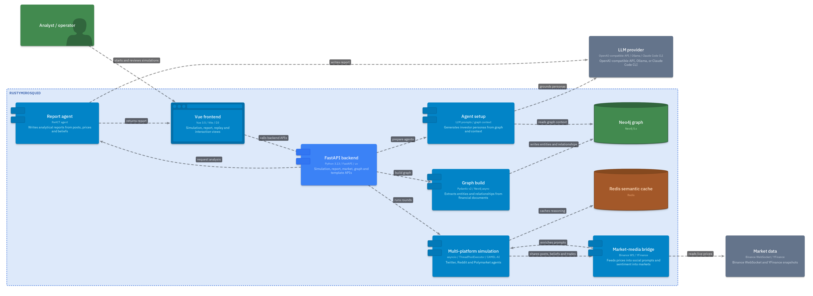

# RustyMiroSquid
Up: [[RustyMiroSquid INDEX]]

#projects #rustymirosquid

<p align="center">
  
</p>

<h1 align="center">🐙 RustyMiroSquid</h1>

<p align="center">
  <strong>High-Performance Multi-Agent Investment Simulation Engine</strong><br>
  Fork of <a href="https://github.com/aaronjmars/MiroShark">MiroShark</a> — mutated for predictive investment analysis with Rust-native data processing, Python Free-threading, and real-time market integration.
</p>

<p align="center">
  
</p>

---

## What Changed from MiroShark?

RustyMiroSquid takes MiroShark's multi-agent simulation engine and transforms it into a **quantitative investment analysis tool**. The core simulation (Twitter + Reddit + Polymarket agents reacting to documents) is preserved, but everything around it is rebuilt for performance and financial use cases.

### Architecture Comparison

| Layer | MiroShark | RustyMiroSquid |
|---|---|---|
| **Python** | 3.11 (GIL-locked) | 3.13+ → 3.15 (Free-threaded, No-GIL) |
| **Package Manager** | pip + npm | UV (Astral) + Bun (Oven) |
| **JSON** | stdlib `json` | `orjson` (Rust-native, 10x faster) |
| **Data Processing** | pandas + Python loops | Polars (Rust-native LazyFrames) |
| **Validation** | dict-based | Pydantic v2 (Rust-core) |
| **Threading** | asyncio only | asyncio (I/O) + ThreadPoolExecutor (CPU) |
| **Token Optimization** | None | LLMLingua compression + Redis semantic cache |
| **Market Data** | None | Binance WebSocket + YFinance snapshots |
| **Sentiment Analysis** | Static per-round | Sentiment Velocity (dS/dt first derivative) |

### New Modules

```
backend/app/services/
├── polars_analytics.py      # Rust-native simulation analytics
├── prompt_compressor.py     # LLMLingua token reduction (40% savings)
├── semantic_cache.py        # Redis-backed reasoning cache
├── market_connector.py      # Real-time WebSocket market feeds
└── sentiment_velocity.py    # First derivative of agent opinion shifts
```

### Performance Targets

| Metric | MiroShark | RustyMiroSquid Target |
|---|---|---|
| JSON serialization | stdlib (1x) | orjson (10x) |
| Data processing | pandas (1x) | Polars (5-50x) |
| CPU utilization | Single-core (GIL) | All cores (No-GIL) |
| Token cost | Baseline | -40% (LLMLingua + cache) |
| Agent count | ~50 | 1000+ |

---

## How It Works

The simulation engine is inherited from MiroShark. RustyMiroSquid adds investment-specific capabilities on top:

1. **Graph Build** — Extracts entities and relationships from financial documents into a Neo4j knowledge graph. NER uses few-shot examples and rejection rules. Chunk processing is parallelized with batched Neo4j writes (UNWIND).
2. **Agent Setup** — Generates investor personas grounded in the knowledge graph. Each entity gets 5 layers of context: graph attributes, relationships, semantic search, related nodes, and LLM-powered web research.
3. **Simulation** — Twitter, Reddit, and Polymarket run simultaneously via `asyncio.gather` (I/O) + `ThreadPoolExecutor` (CPU). Agents see cross-platform context. Belief states track stance, confidence, and trust per agent.
4. **Market Integration** — Live price feeds from Binance (crypto) and YFinance (equities) enrich agent prompts. Sentiment velocity tracks the speed of opinion shifts.
5. **Report** — A ReACT agent writes analytical reports citing actual agent posts, market movements, and belief trajectories.

---

## Architecture Diagram



---

## Architecture

```
                    ┌─────────────────────────────────────────┐
                    │         Round Memory (sliding window)    │
                    │  Old rounds: LLM-compacted summaries     │
                    │  Previous round: full action detail       │
                    │  Current round: live (partial)            │
                    └──────┬──────────┬──────────┬────────────┘
                           │          │          │
                    ┌──────▼───┐ ┌────▼─────┐ ┌─▼────────────┐
                    │ Twitter  │ │  Reddit  │ │  Polymarket   │
                    │          │ │          │ │               │
                    │ Posts    │ │ Comments │ │ Trades (AMM)  │
                    │ Likes    │ │ Upvotes  │ │ Single market │
                    │ Reposts  │ │ Threads  │ │ Buy/Sell/Wait │
                    └──────┬───┘ └────┬─────┘ └─┬────────────┘
                           │          │          │
                    ┌──────▼──────────▼──────────▼────────────┐
                    │         Market-Media Bridge              │
                    │  Social sentiment → trader prompts       │
                    │  Market prices → social media prompts    │
                    │  Live Binance/YFinance → enrichment      │
                    └──────┬──────────┬──────────┬────────────┘
                           │          │          │
                    ┌──────▼──────────▼──────────▼────────────┐
                    │         Belief State (per agent)         │
                    │  Positions: topic → stance (-1 to +1)    │
                    │  Confidence: topic → certainty (0 to 1)  │
                    │  Trust: agent → trust level (0 to 1)     │
                    │  Velocity: dS/dt sentiment derivative    │
                    └─────────────────────────────────────────┘
```

---

## Quick Start

### Prerequisites

- Python 3.13+ (installed via UV)
- Bun (replaces npm)
- Neo4j 5.15+ **or** Docker
- An OpenAI-compatible API key, Ollama, **or** Claude Code CLI

### Setup

```bash
# 1. Start Neo4j

docker run -d --name neo4j \
  -p 7474:7474 -p 7687:7687 \
  -e NEO4J_AUTH=neo4j/miroshark \
  neo4j:5.15-community

# 2. Configure
cp .env.example .env
# Edit .env with your LLM provider settings

# 3. Install & run
bun run setup:all
bun run dev
```

Open `http://localhost:3000` — backend API at `http://localhost:5001`.

### Docker

```bash
docker compose up --build
```

---

## Configuration

### Recommended Models

| Model | ID | Cost/sim | Notes |
|---|---|---|---|
| **Qwen3 235B A22B** ⭐ | `qwen/qwen3-235b-a22b-2507` | ~$0.30 | Best overall |
| GPT-5 Nano | `openai/gpt-5-nano` | ~$0.41 | Budget option |
| Gemini 2.5 Flash Lite | `google/gemini-2.5-flash-lite` | ~$0.58 | Good alt |

### Environment Variables

All settings live in `.env` (copy from `.env.example`). Key variables:

```bash
LLM_PROVIDER=openai          # "openai" or "claude-code"
LLM_API_KEY=ollama
LLM_BASE_URL=http://localhost:11434/v1
LLM_MODEL_NAME=qwen3.5:27b
NEO4J_URI=bolt://localhost:7687
EMBEDDING_PROVIDER=ollama
EMBEDDING_MODEL=nomic-embed-text
```

---

## Tech Stack

| Layer | Tech |
|---|---|
| Backend Runtime | Python 3.13+ (target: 3.15 Free-threaded) |
| Package Manager | UV (Astral) + Bun (Oven) |
| Web Framework | FastAPI 0.115+ |
| Data Processing | Polars (Rust-core), orjson |
| Validation | Pydantic v2 (Rust-core) |
| Graph DB | Neo4j 5.x (async driver) |
| Cache | Redis (semantic caching) |
| LLM | Qwen 3.5 35B via vLLM/Ollama |
| Simulation | CAMEL-AI + Wonderwall (fork OASIS) |
| Frontend | Vue 3.5 + Vite 7.2 + D3.js + Bun |

---

## Use Cases

- **Trading signal simulation** — Feed financial news, observe simulated market sentiment and prediction market movements
- **PR crisis testing** — Simulate public reaction to announcements before publishing
- **Policy analysis** — Test regulations against a simulated public with investment behavior
- **Sentiment velocity research** — Track the speed of opinion shifts as a predictive signal

---

## Credits

Built on [MiroShark](https://github.com/aaronjmars/MiroShark) by [aaronjmars](https://github.com/aaronjmars). Neo4j + Ollama storage layer adapted from [MiroFish-Offline](https://github.com/nikmcfly/MiroFish-Offline). Simulation engine powered by [OASIS](https://github.com/camel-ai/oasis) (CAMEL-AI).

AGPL-3.0. See [LICENSE](./LICENSE).
